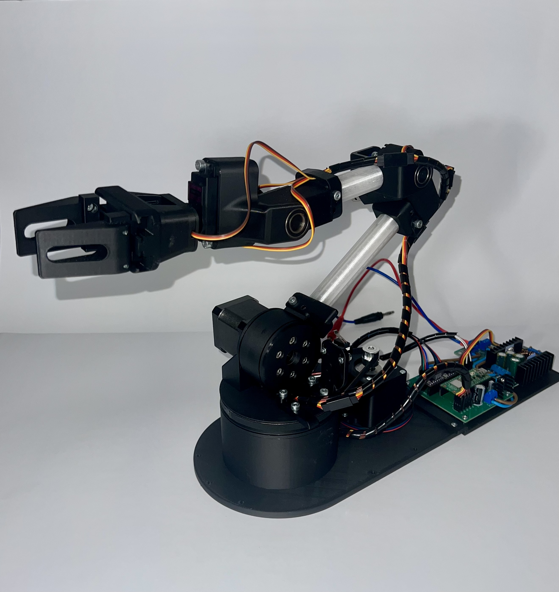

<div align="center">

# 🦾 5-DOF Robotic Arm

**Complete control system for a 5 degrees of freedom robotic arm**

[](https://www.python.org/)
[](https://www.raspberrypi.com/products/raspberry-pi-pico/)
[](https://www.kicad.org/)



</div>

---

## 📋 Project Description

Comprehensive 5-DOF robotic arm control system including:

- 🔌 **Electronics Design** - custom PCB board
- 🎮 **Low-level Control** - firmware for Raspberry Pi Pico
- 🖥️ **High-level Server** - motion controller and kinematics
- 🎨 **Graphical Interface** - control and visualization application
- 🚀 **Automation** - Ansible deployment scripts

---

## 🗂️ Project Structure

```
📦 prac_inz/
├── 📁 board/                    # 🔌 Electronics
│   └── pico-board/             # PCB project in KiCad
│       ├── *.kicad_sch         # Schematic design
│       ├── *.kicad_pcb         # PCB layout
│       └── gerberki/           # Production Gerber files
│
├── 📁 lowlevel/                 # ⚡ Low-level firmware
│   └── pipico/
│       ├── cpp/                # C++ implementation
│       └── MicroPython/        # MicroPython implementation
│
├── 📁 highlevel/                # 🖥️ Control server
│   ├── robot_server.py         # TCP server (port 5555)
│   ├── controller/             # Motion controller
│   ├── domain/                 # Data models (Pose, RobotState)
│   └── uartcomm/               # UART communication
│
├── 📁 interface/                # 🎨 Control GUI
│   ├── main.py                 # PySide6 application
│   └── inter/
│       ├── app.py              # Application logic
│       ├── robot_client.py     # TCP client
│       └── ui/                 # UI components
│
├── 📁 mechanics/                # ⚙️ Mechanical design
│   └── technical_drawings/     # Technical drawings (PDF)
```

---

## 🛠️ Technology Stack

### Hardware

- **Microcontroller:** Raspberry Pi Pico (RP2040)
- **Communication:** UART, TCP/IP
- **PCB:** KiCad 6+

### Software

#### Low-level

- **Languages:** C++, MicroPython
- **Platform:** Raspberry Pi Pico SDK

#### High-level

- **Languages:** Python 3.12+
- **Frameworks:**
  - PySide6 (GUI)
  - NumPy, SciPy (calculations)
  - Matplotlib (visualization)
- **Dependency Management:** Poetry
- **Automation:** Ansible

#### Kinematics

- **Methods:** Forward Kinematics, Inverse Kinematics

---

## 🚀 Quick Start

### 1️⃣ Installing Dependencies

Each module uses Poetry for dependency management:

```bash
# High-level server
cd highlevel
poetry install

# Interface GUI
cd interface
poetry install
```

### 2️⃣ Starting the Server

```bash
cd highlevel
poetry run python robot_server.py --tcp-host 127.0.0.1 --tcp-port 5555
```

### 3️⃣ Starting the Interface

```bash
cd interface
poetry run interface
```

---

## 📡 Communication Protocol

TCP server listens on port **5555** and accepts JSON commands terminated with `\n`.

### Example Commands

#### Joint Space Motion

```json
{
  "type": "manual_joints",
  "joints": [0, 45, 90, -45, 0],
  "velocity": 45.0,
  "move_type": "movej"
}
```

#### Task Space Motion

```json
{
  "type": "manual_pose",
  "pose": { "x": 300, "y": 0, "z": 200, "pitch": 45, "yaw": 0 },
  "velocity": 100.0,
  "move_type": "movel"
}
```

#### Gripper Control

```json
{
  "type": "gripper",
  "action": "open"
}
```

---

## 🔧 Deployment

Automatic deployment to Raspberry Pi:

```bash
cd highlevel-system
ansible-playbook -i inventories/rpi.yml playbooks/setup_all.yml
```

---

## 📐 Kinematics

Kinematics solution is implemented at two levels:

- **MATLAB** - symbolic equation derivation, algorithm testing
- **Python** - production implementation in `highlevel/kinematics/` module

Methods:

- ✅ Forward Kinematics (FK) - transformation matrices
- ✅ Inverse Kinematics (IK) - Damped Least Squares (DLS)
- ✅ Trajectory planning

---

## 📚 Documentation

Detailed documentation can be found in each repository:

- [highlevel](https://github.com/arm-5dof/highlevel#readme) - server communication protocol
- [interface](https://github.com/arm-5dof/interface#readme) - GUI user manual
- [lowlevel](https://github.com/arm-5dof/lowlevel#readme) - firmware documentation
- [board](https://github.com/arm-5dof/board#readme) - electronics specifications

---
